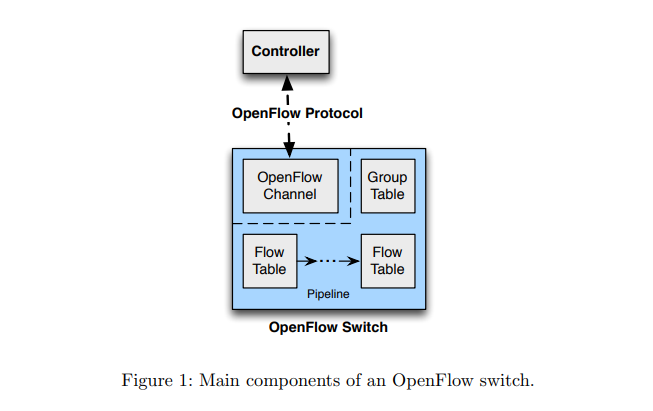

> An OpenFlow Switch consists of one or more flow tables and a group table, which perform packet lookups and forwarding, and an OpenFlow channel to an external controller 

一个OpenFLow交换器包含一个组表和多个流表。
