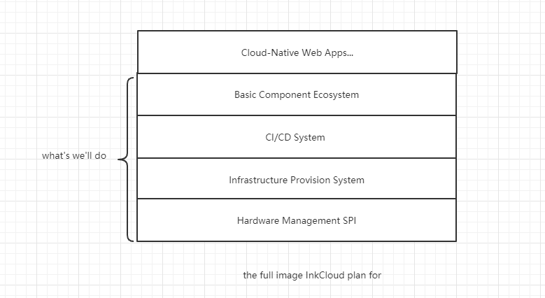

= the whole plan

In this chapter,we'll explain what we're going to do in the project.Since 2019 10,the first
time I've heart about SDN,VxLAN etc. those kind of software-defined portfolio have attracted
my attention.

In my experience, there's a lot of tools,such as Jenkins,Travis etc. which aims to be a
CI/CD tools,there are quite a lot of drawbacks I want to fix. yet I want to define a brand-new
script tools which is going to orchestrate the whole process after a push of Version Control System.

WARNING: So Basically,to accomplish this simple goal,it's not that simple. To keep it stupid and simple.
we'll make a simple command line and Restful API application only compatible with linux system.

== Full Image

the full image is present below,which is quite similar to IASS,PASS and SASS

*  Hardware Management SPI

It's a good practice to not make any assumption about underlay hardware,but It's highly
recommended to use workgroup model,which I'll explain later. Hardware Management SPI is a
SPI,so we'll offer an reasonable and common default solution that also implements SPI.

*  Infrastructure Provision System

provision the VM. VM is actually consist of three resources:

1. Compute
2. Storage
3. Network

however unlike OpenStack,I don't think network is easy to manage like storage.
With SDN coming,we'll take a network model from public cloud. Using the VxLAN
to separate different tenants,and using SDN related tech only design network within
a tenant network space.Also,we'll assort to DPDK to build a good network.

VM Scheduler is a role take this responsibility to schedule a new VM creating request
to the right place.

* CI/CD System

That's the main purpose of this project. CI/CD is a process,but in fact,it differs
between companies. To put it simple,it's vendor-specific,which is can't portable
between organization.

We want to develop a tool with ability switching between the public/private cloud environment,
dev/production environment easily.

Also,it provide you two main way,either virtualization(containerized) and bare metal deployment

* Basic Component EcoSystem

what's you want to do when develop a application depend external system,it may be
message-queue,database etc. So what if you describe that I want MySQL databases with
redundancy,failover ability with 1 master and 3 slaves, I want a kafka with simple default
configuration that can be accessed externally.

This Layer is not the important part,so we'll postpone it util the Infrastructure Provision System
stable and fast.

== network
image::images/network.jpg[scaledwidth=75%]